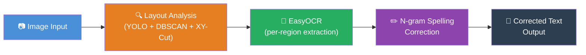

<div align="center">
  
# 🪄 OCR Spell Correction

[](https://huggingface.co/spaces/TangSan003/OCRSpellCorrection)
[](https://www.python.org/downloads/)
[](https://opensource.org/licenses/MIT)

**A comprehensive OCR pipeline combining Layout Analysis, Region-level OCR, and N-gram Spelling Correction for Vietnamese text.**

[Live Demo](https://huggingface.co/spaces/TangSan003/OCRSpellCorrection) • [Installation](#-quick-start-docker) • [API Reference](#-api-reference) • [Technical Deep Dive](#-technical-deep-dive)

</div>

---

## 🚀 Live Demo

Test the application live on Hugging Face Spaces: **[TangSan003/OCRSpellCorrection](https://huggingface.co/spaces/TangSan003/OCRSpellCorrection)**

| Input Document | OCR + Spelling Correction Output |
|:---:|:---:|
|  |  |

---

## 🌟 Project Overview

**OCRSpellCorrection** is a research and development project focused on significantly improving the output accuracy of Optical Character Recognition (OCR) models, specifically targeting **EasyOCR**. It addresses common challenges like complex document layouts and diacritical errors in Vietnamese.

### 🏗️ Architecture

The pipeline processes document images through four major stages:



> [!NOTE]  
> **Why is this pipeline necessary?**
> - **Layout Analysis:** Prevents OCR engines from reading text in the wrong order (e.g., jumping between columns) using YOLO and XY-Cut.
> - **EasyOCR:** Extracts raw text independently from each region, avoiding cross-region confusion.
> - **N-gram Correction:** Fixes frequent Vietnamese diacritical errors using context from surrounding words.

### 🎯 Research Pillars

1. **Spelling Correction (✅ Completed)**: Utilizes a robust N-gram model (1/2/3-grams) built from crawled Vietnamese job-posting data.
2. **Layout Reconstruction (✅ Completed)**: Employs YOLO (`hantian/yolo-doclaynet`) and the XY-Cut algorithm to determine natural reading orders.
3. **Image Enhancement (⏳ Future Work)**: Pre-processing techniques (denoising, binarization) to maximize initial EasyOCR prediction probability.

---

## 🐳 Quick Start (Docker)

The most reliable way to run OCRSpellCorrection is using **Docker**, as it encapsulates all required system dependencies.

> [!IMPORTANT]  
> Ensure you have [Docker](https://docs.docker.com/get-docker/) and [Docker Compose](https://docs.docker.com/compose/install/) installed on your system.

```bash
# 1. Clone the repository
git clone https://github.com/quangts2531/OCRSpellCorrection.git
cd OCRSpellCorrection

# 2. Build and start the container
docker-compose up --build -d

# 3. Access the web app
# Open http://localhost:5000 in your browser
```

To view logs: `docker logs -f ocr-app`  
To shut down: `docker-compose down`

---

## 💻 Local Development

If you prefer to run the project without Docker, follow these steps:

### Prerequisites
- **Python 3.9+**
- **OpenCV System Libraries** (Linux only):
  ```bash
  sudo apt-get update && sudo apt-get install -y libgl1 libglib2.0-0 libsm6 libxext6 libxrender-dev
  ```

### Setup

```bash
# 1. Create and activate a virtual environment
python -m venv venv
source venv/bin/activate  # Linux/macOS
# venv\Scripts\activate   # Windows

# 2. Install dependencies
pip install -r requirements.txt

# 3. Set Environment Variables (Optional but recommended)
export HF_HOME=./.cache/huggingface
export EASYOCR_MODULE_PATH=./.cache/easyocr
export CUDA_VISIBLE_DEVICES=""
export OMP_NUM_THREADS=2
export MKL_NUM_THREADS=2

# 4. Run the application
python app.py
```
*The server will start on `http://localhost:7860/`.*

> [!WARNING]  
> **Slow First Startup:** The first run will take 2-5 minutes to download EasyOCR and YOLO models (~200MB). Subsequent runs will use the cached models.

<details>
<summary>⚙️ Environment Variables Configuration</summary>

| Variable | Default Value | Description |
| :--- | :--- | :--- |
| `HF_HOME` | `/app/.cache/huggingface` | Hugging Face model cache directory. |
| `EASYOCR_MODULE_PATH` | `/app/.cache/easyocr` | EasyOCR model weights directory. |
| `CUDA_VISIBLE_DEVICES` | `""` | GPU access. Empty string forces CPU-only. |
| `OMP_NUM_THREADS` | `2` | Max threads for OpenMP parallel CPU computations. |
| `MKL_NUM_THREADS` | `2` | Max threads for Intel MKL CPU optimization. |

</details>

---

## 🔌 API Reference

### `POST /upload`
Uploads an image and returns the extracted + corrected text.

**Request:**
- `Content-Type`: `multipart/form-data`
- `image`: File (Required, allowed: `.png`, `.jpg`, `.jpeg`, `.gif`)

```bash
curl -X POST http://localhost:7860/upload \
  -F "image=@/path/to/document.jpg"
```

**Response (200 OK):**
```json
{
  "text": "Xin chào thế giới\nĐây là một tài liệu mẫu\n"
}
```

---

## 🧠 Technical Deep Dive

<details>
<summary><b>1. Spelling Correction (N-gram Model)</b></summary>

Built on SymSpell with Vietnamese language models trained on ~75MB of job-posting data.
- **1-gram (15,373 entries):** Generates candidate corrections via edit-distance lookup.
- **2-gram (59,037 entries) & 3-gram (74,049 entries):** Scores candidates based on contextual probability.
The model automatically skips numbers, emails, and proper nouns (detected via Underthesea NER).

</details>

<details>
<summary><b>2. Layout Reconstruction</b></summary>

- **YOLO Layout Detection:** Uses `hantian/yolo-doclaynet` to detect paragraphs, titles, tables, etc., filtering out irrelevant headers/footers.
- **DBSCAN Clustering:** Groups nearby bounding boxes.
- **Recursive XY-Cut Algorithm:** Recursively splits the page along horizontal and vertical projection gaps to determine a natural left-to-right, top-to-bottom reading sequence.
</details>

---

## 📊 Evaluation Metrics

Evaluate pipeline quality using **CER (Character Error Rate)** and **WER (Word Error Rate)** via the `jiwer` library.

```python
from jiwer import wer, cer

ground_truth = ["xin chào thế giới"]
hypothesis   = ["xin chao the gioi"]

print(f"CER: {cer(ground_truth, hypothesis):.2%}")
print(f"WER: {wer(ground_truth, hypothesis):.2%}")
```

> [!TIP]  
> Run the provided `evaluate.py` script with your own paired dataset to benchmark the pipeline.

---

## 📂 Project Structure

<details>
<summary>Click to expand folder structure</summary>

```text
OCRSpellCorrection/
├── craw/                         # Scraper scripts and raw training data
├── dictionary/                   # N-gram language models (1/2/3-grams)
├── nginx/                        # Nginx reverse proxy config
├── templates/                    # Web UI templates (index.html)
├── app.py                        # Flask API entry point
├── image_to_text.py              # Orchestrates YOLO, XY-Cut, and EasyOCR
├── probabilities.py              # N-gram spelling correction engine
├── xycut.py                      # Recursive XY-Cut reading order algorithm
├── evaluate.py                   # CER/WER evaluation script
├── Dockerfile                    # Multi-stage Docker build
└── docker-compose.yml            # Docker Compose orchestration
```
</details>

---

## 📄 License

This project is distributed under the [MIT License](./LICENSE).