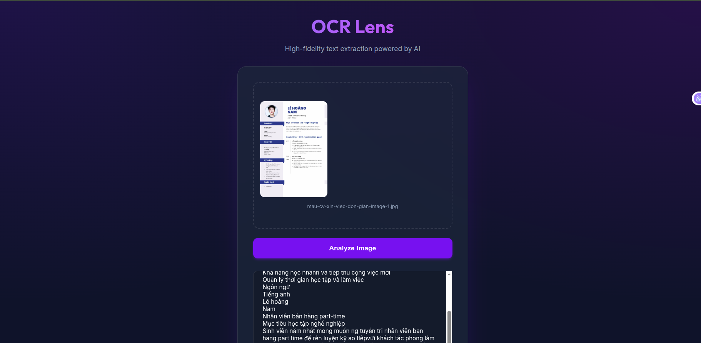
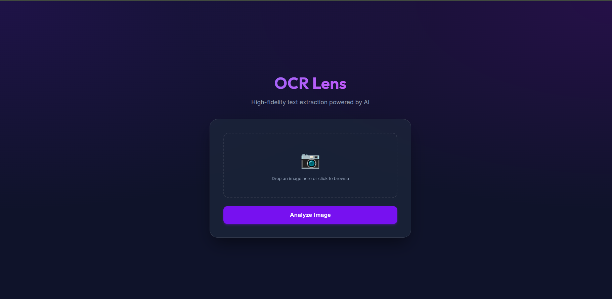

# OCRSpellCorrection

[](https://huggingface.co/spaces/TangSan003/OCRSpellCorrection)

**Live Demo / Deployment:** You can test the application live here: [https://huggingface.co/spaces/TangSan003/OCRSpellCorrection](https://huggingface.co/spaces/TangSan003/OCRSpellCorrection)

---

## Demo

| Input document | OCR + Spelling correction output |
|:-:|:-:|
|  |  |

---

## 1. Project Introduction & Research Overview

**OCRSpellCorrection** is a research and development project focused on significantly improving the output accuracy of Optical Character Recognition (OCR) models, specifically targeting **EasyOCR**. The core objective is achieved through a comprehensive pipeline that combines input image pre-processing, layout analysis, and output spelling correction.

### Architecture Overview

The full processing pipeline flows through four major stages. When a user uploads a document image, it passes through layout analysis, region-level OCR, and finally N-gram spelling correction before the final text is returned.


**Why each stage is necessary:**

| Stage | Problem It Solves |
| :--- | :--- |
| **Layout Analysis (YOLO + XY-Cut)** | Multi-column documents, tables, and complex layouts cause OCR engines to read text in the wrong order (e.g., jumping between columns). YOLO detects document regions, DBSCAN clusters nearby regions, and XY-Cut determines a human-readable top-to-bottom, left-to-right reading order. |
| **EasyOCR** | Extracts raw text from each layout region independently, avoiding cross-region confusion. Supports both Vietnamese (`vi`) and English (`en`). |
| **N-gram Spelling Correction** | Vietnamese OCR frequently produces diacritical errors (e.g., `ả` → `a`, `ổ` → `ô`). The N-gram model uses context from surrounding words (bigrams and trigrams) to select the most probable correction from a candidate list. |

### Research Pillars

The project is structured around three main pillars:

### Pillar 1: Spelling Correction (Completed / Implemented)
*   **Description:** Post-processing the raw text extracted by OCR to detect and correct spelling errors.
*   **Reference Paper:** [*Building an Automatic Spelling Correction System Using N-Gram Information Surrounding Error Word in Vietnamese Queries*](https://ieeexplore.ieee.org/abstract/document/10883437)
*   **Algorithm Used:** N-gram approach.
*   **Reasoning:** The N-gram methodology is easily scalable because massive amounts of unlabeled text data can be crawled and utilized to build the language models. This allows for quick deployment without the heavy time constraints and costs associated with manual data labeling.
*   **Key Tasks Done:** Extensive data crawling, building robust 1-gram, 2-gram, and 3-gram language models, and implementing the core spelling correction logic.

  The final language model contains 15,373 unigrams, 59,037 bigrams, and 74,049 trigrams built from Vietnamese job-posting and CV text.

### Pillar 2: Illogical Document Layout Reconstruction (Completed / Implemented)
*   **Description:** Reorganizing and reconstructing non-logical, fragmented, or complex document image layouts into a readable, sequential format prior to text extraction.
*   **Reference Papers:** 
    *   [*A Hybrid Approach for Document Layout Analysis in Document images*](https://arxiv.org/abs/2404.17888)
    *   [*PubLayNet: largest dataset ever for document layout analysis*](https://arxiv.org/abs/1908.07836)
*   **Algorithm Used:** XY Cut algorithm paired with a YOLO layout detection model (`hantian/yolo-doclaynet`).

### Pillar 3: Input Image Quality Enhancement (Future Work / Not Yet Coded)
*   **Description:** Utilizing pre-processing techniques to improve the raw input image quality (e.g., denoising, binarization, de-skewing) before passing it to the OCR model. The goal is to maximize the initial character prediction probability of EasyOCR.
*   **Status:** Currently in the research phase; pending implementation.

---

## 2. How It Works — Technical Deep Dive

This section provides a detailed walkthrough of every component in the pipeline.

### 2.1 Spelling Correction (`probabilities.py`)

The spelling correction module is built on the **SymSpell** library and uses **N-gram language models** (1-gram, 2-gram, and 3-gram) to choose the best correction for each potentially misspelled word.

#### Dictionary & Training Data

The language models were built by crawling Vietnamese job listing data from TopCV (stored in `craw/job_details.json`, ~75 MB of raw text). The scripts in the `dictionary/` folder process this data:

1. **`convert_frequency.py`** — Tokenizes the crawled text using [Underthesea](https://github.com/undertheseanlp/underthesea) (`word_tokenize`, `sent_tokenize`, `text_normalize`), counts word frequencies, and writes a 1-gram frequency file. Only words appearing more than 5 times (or 1,000 times for sub-word splits) are retained.
2. **`dic_2_gram.py`** — Builds a bigram dictionary by sliding a window of size 2 over tokenized text. Each entry is a pair of consecutive tokens joined by `_` with its co-occurrence count. Only pairs with count > 5 are kept.
3. **`dic_3_gram.py`** — Same approach but with a window of size 3 (trigrams).

The resulting dictionaries loaded at runtime are:

| Dictionary File | Entries | Description |
| :--- | ---: | :--- |
| `frequency_vi_test.txt` | ~17,871 | 1-gram (single words) with frequency counts |
| `dic_2_gram_test.txt` | ~55,899 | 2-gram (word pairs) with co-occurrence counts |
| `dic_3_gram_test.txt` | ~88,184 | 3-gram (word triples) with co-occurrence counts |

Each file uses `$` as a delimiter between the n-gram and its count, e.g.:
```
mô_tả$23472
công$124833
```

#### How Correction Works Step-by-Step

1. **Tokenization** — The input sentence is tokenized with Underthesea's `word_tokenize(text, format="text")`. This segments Vietnamese compound words (e.g., `"xin chào"` → `"xin_chào"`).

2. **Candidate Generation** — For each token, `word_tokenizer_suggestions()` uses SymSpell's `lookup()` (edit distance ≤ 2) to find candidate corrections from the 1-gram dictionary. Each candidate has three attributes: `term`, `distance` (edit distance from the original), and `count` (frequency in the corpus). Tokens that are numbers, emails, phone numbers, or proper nouns (detected via Underthesea's `ner()`) are skipped.

3. **Context Scoring** — When a word has multiple candidates (distance > 0), `fix_spelling_word()` scores each candidate using contextual N-gram probabilities:
   - **Left bigram probability**: Look up `left_word + "_" + candidate` in the 2-gram dictionary.
   - **Right bigram probability**: Look up `candidate + "_" + right_word` in the 2-gram dictionary for each candidate of the next word.
   - **Trigram probability**: Look up `left_word + "_" + candidate + "_" + right_word` in the 3-gram dictionary.
   - For each N-gram lookup, `count_word()` returns the frequency count if an exact match (distance = 0) is found.

4. **Selection Formula** — All probabilities (left, right, trigram) across all candidates are collected. The total count `sum_count` is computed. For each probability entry:
   ```
   P = count / sum_count    (if count > 0, else P = 0)
   ```
   The candidate with the highest `P` wins. The direction (`"left"` or `"right"`) determines whether the winning candidate absorbs the preceding or following word in the output sequence.

5. **Reconstruction** — The corrected tokens are joined back with spaces, and underscores in compound words are replaced with spaces.

#### Concrete Example

Given an OCR output with errors:

```
Input:  "Có kinh nghiệm lý đội nhóm gổm 20 nhan vien"
```

The correction process handles:
- `"lý"` → candidates include `"lý"`, `"lí"` — bigram `"nghiệm_lý"` has low frequency, but context with `"đội"` helps select the correct form
- `"gổm"` → candidate `"gồm"` wins because bigrams like `"nhóm_gồm"` have high co-occurrence count
- `"nhan"` → candidate `"nhân"` (diacritical correction)
- `"vien"` → candidate `"viên"` (diacritical correction), reinforced by bigram `"nhân_viên"` having very high frequency
- `"20"` is skipped (matches the numeric regex pattern)

```
Output: "Có kinh nghiệm lý đội nhóm gồm 20 nhân viên"
```

### 2.2 Layout Reconstruction (`xycut.py` + `image_to_text.py`)

The layout reconstruction pipeline ensures that text regions in complex documents (multi-column layouts, CVs, forms) are read in the correct human-readable order.

#### YOLO Layout Detection

The pipeline uses the **`hantian/yolo-doclaynet`** model (YOLOv8s variant, downloaded from Hugging Face Hub) to detect document layout regions. The model is trained on DocLayNet and can identify region types such as:
- Text paragraphs
- Titles / headings
- Tables
- Figures
- Lists
- Page headers / footers

The YOLO inference is configured in `split_image()` with:
- `imgsz=1024` — Input image size
- `conf=0.15` — Low confidence threshold to capture more regions
- `iou=0.4` — IoU threshold for Non-Maximum Suppression
- `agnostic_nms=True` — Class-agnostic NMS to avoid duplicate detections across classes

**Class filtering:** Regions with `class_id == 6` (page footers/headers) are explicitly excluded from OCR processing, as they typically contain noise or irrelevant metadata.

#### DBSCAN Clustering

After YOLO detection, the bounding box centers are clustered using **DBSCAN** (from scikit-learn):
- `eps = avg_height * 4` — The maximum distance between two samples to be considered in the same neighborhood, scaled by the average box height
- `min_samples = 1` — Every point forms at least its own cluster

This step groups spatially close regions (e.g., a title and its sub-heading) into single logical blocks, producing merged bounding boxes for each cluster.

#### XY-Cut Algorithm Step-by-Step

The **Recursive XY-Cut** algorithm (`recursive_xy_cut()`) determines reading order by recursively splitting the page along horizontal and vertical projection gaps:

1. **Y-axis projection (horizontal cut):** 
   - Sort all bounding boxes by their top `y` coordinate.
   - Project all boxes onto the Y-axis to create a 1D histogram (`projection_by_bboxes(axis=1)`).
   - Find gaps in the projection using `split_projection_profile()` — gaps are contiguous zero-value intervals with `min_gap > 1`.
   - Each non-gap segment represents a horizontal strip of content.

2. **X-axis projection (vertical cut):**
   - Within each horizontal strip, sort boxes by their left `x` coordinate.
   - Project onto the X-axis (`projection_by_bboxes(axis=0)`).
   - Find vertical gaps — if gaps exist, the strip contains multiple columns.

3. **Recursion:**
   - If vertical gaps split the strip into multiple column groups, recursively apply XY-Cut to each group.
   - If no vertical split is possible (single column), append the box indices to the result list in their current sorted order.

4. **Overlap merging:** After XY-Cut produces a sorted order, `image_to_text.py` performs a final overlap-merging pass — any boxes that spatially overlap are merged into a single bounding box using `is_overlapping()`.

#### What "Illogical Layout" Means in Practice

**Before reconstruction** (naive left-to-right, top-to-bottom reading):
```
┌──────────────────────────────────┐
│ PERSONAL INFO  │  WORK EXPERIENCE│
│ Name: Nguyen   │  2020-2023      │
│ Phone: 0901... │  Software Dev   │
│                │  at Company X   │
└──────────────────────────────────┘

Naive OCR order: "PERSONAL INFO WORK EXPERIENCE Name: Nguyen 2020-2023
                  Phone: 0901... Software Dev at Company X"
```

**After reconstruction** (XY-Cut identifies two columns):
```
Column 1: "PERSONAL INFO → Name: Nguyen → Phone: 0901..."
Column 2: "WORK EXPERIENCE → 2020-2023 → Software Dev at Company X"

Final output:
"PERSONAL INFO
Name: Nguyen
Phone: 0901...
WORK EXPERIENCE
2020-2023
Software Dev at Company X"
```

### 2.3 OCR Engine (`image_to_text.py`)

The `ImageToText` class orchestrates the full pipeline. Here is the function-by-function walkthrough:

#### `__init__(self)`
1. Instantiates `Probability()` — loads all three N-gram dictionaries into SymSpell.
2. Creates an EasyOCR `Reader` for Vietnamese (`vi`) and English (`en`).
3. Downloads the YOLO model weights (`yolov8s-doclaynet.pt`) from Hugging Face Hub via `hf_hub_download()` and loads them with `YOLO()`.

#### `split_image(self, image_path) → list[list[int]]`
1. Runs YOLO inference on the full image → gets bounding boxes for all detected regions.
2. Filters out class 6 (page footers) and invalid zero-area boxes.
3. Clusters remaining boxes with DBSCAN → merges each cluster into a single bounding box.
4. Runs `recursive_xy_cut()` on the clustered boxes to determine reading order.
5. Performs an overlap-merging pass to combine any remaining overlapping regions.
6. Returns the final sorted list of bounding boxes `[x_min, y_min, x_max, y_max]`.

#### `image_to_text(self, image_path) → str`
1. Calls `split_image()` to get sorted bounding boxes.
2. Reads the image with OpenCV.
3. For each bounding box in reading order:
   - Crops the region from the image: `image[y_min:y_max, x_min:x_max]`
   - Runs `self.reader.readtext()` on the cropped region → returns list of `(bbox, text, confidence)`.
   - Concatenates all text fragments with `\n`.
   - Applies regex `r'\n(?![A-Z])'` to join lines that don't start with an uppercase letter (heuristic for paragraph continuation).
   - Splits the result by `\n` and applies `self.probability.fix_spelling()` to each line.
   - Capitalizes the first letter of each corrected line.
4. Returns the final concatenated text.

#### Reading Order Logic

The reading order is determined by the combination of:
1. **DBSCAN clustering** — groups nearby regions into logical blocks
2. **XY-Cut sorting** — orders blocks in a top-to-bottom, then left-to-right sequence
3. **Overlap merging** — ensures no duplicate reading of overlapping regions

This three-step approach handles documents ranging from single-column articles to multi-column CVs and forms.

---

## 3. Environment Variables Configuration

The application uses specific environment variables to manage execution resources and model caching. Below are the required environment variables:

| Variable | Default Value | Description |
| :--- | :--- | :--- |
| `HF_HOME` | `/app/.cache/huggingface` | Defines the directory where Hugging Face will cache downloaded models (e.g., the YOLO layout model). |
| `EASYOCR_MODULE_PATH` | `/app/.cache/easyocr` | Defines the directory where EasyOCR will store its downloaded model weights. |
| `CUDA_VISIBLE_DEVICES` | `""` (Empty string) | Controls which GPUs are accessible to PyTorch/YOLO. Set to an empty string to force CPU-only execution. |
| `OMP_NUM_THREADS` | `2` | Specifies the maximum number of threads OpenMP can use for parallel CPU computations. |
| `MKL_NUM_THREADS` | `2` | Specifies the number of threads for the Intel Math Kernel Library (MKL) to optimize CPU performance. |

**Example `.env` file for local setup:**
```env
HF_HOME=./.cache/huggingface
EASYOCR_MODULE_PATH=./.cache/easyocr
CUDA_VISIBLE_DEVICES=""
OMP_NUM_THREADS="2"
MKL_NUM_THREADS="2"
```

---

## 4. Installation & Docker Execution Guide

The most reliable way to run OCRSpellCorrection is using **Docker** and **Docker Compose**, as it encapsulates all required system dependencies (like OpenCV's `libgl1`) and Python packages.

### Prerequisites
*   Docker installed on your system.
*   Docker Compose installed.

### Step-by-Step Execution

1.  **Clone the repository and navigate to the project directory:**
    ```bash
    git clone https://github.com/quangts2531/OCRSpellCorrection.git
    cd OCRSpellCorrection
    ```

2.  **Build and start the application container:**
    Run the following command to build the Docker image and start the Flask web server. The `--build` flag ensures that any changes to your code or dependencies are captured.
    ```bash
    docker-compose up --build -d
    ```

3.  **Access the application:**
    Once the container is running, the OCR web application will be accessible at:
    `http://localhost:5000/`

4.  **View container logs (Optional):**
    If you need to debug or watch the OCR processing logs:
    ```bash
    docker logs -f ocr-app
    ```

### Cleanup Instructions

When you are done testing and want to stop the application and free up system resources, run the following commands:

1.  **Stop and remove the container:**
    ```bash
    docker-compose down
    ```

2.  **Clean up dangling images and unused resources (Optional but recommended):**
    ```bash
    docker system prune -f
    ```

---

## Running Locally (without Docker)

**Requirements:** Python 3.9+

```bash
# 1. Clone the repository
git clone https://github.com/quangts2531/OCRSpellCorrection.git
cd OCRSpellCorrection

# 2. Install system dependencies (Ubuntu/Debian)
sudo apt-get install -y libgl1-mesa-glx libglib2.0-0

# 3. Install Python dependencies
pip install -r requirements.txt

# 4. Run the application
python app.py
```

The app will start at `http://localhost:7860`.

> **Note:** On first run, EasyOCR will automatically download the Vietnamese language model (~50MB) and the YOLO doclaynet model from HuggingFace. This may take a few minutes.

## API Reference

### `GET /`
Returns the main web UI.

### `POST /upload`
Performs OCR on an uploaded image.

**Request:** `multipart/form-data`

| Field   | Type   | Description              |
|---------|--------|--------------------------|
| `image` | file   | Image file (PNG/JPG/JPEG/GIF, max 10MB) |

**Response (success):**
```json
{
  "text": "Extracted and spell-corrected text..."
}
```

**Response (error):**
```json
{
  "error": "Error message"
}
```

**Example:**
```bash
curl -X POST http://localhost:7860/upload \
  -F "image=@your_document.jpg"
```

### `GET /health`
Health check endpoint for Docker.

**Response:**
```json
{ "status": "ok" }
```

---

## 5. Local Development (without Docker)

If you prefer to run the project directly on your host machine without Docker, follow these steps.

### Prerequisites

- **Python 3.9+** (the Docker image uses `python:3.9-slim`)
- **pip** package manager
- **System libraries** for OpenCV (required on Linux):
  ```bash
  # Debian / Ubuntu
  sudo apt-get update && sudo apt-get install -y \
      libgl1 libglib2.0-0 libsm6 libxext6 libxrender-dev
  ```

### Step-by-Step Setup

1.  **Clone the repository:**
    ```bash
    git clone https://github.com/quangts2531/OCRSpellCorrection.git
    cd OCRSpellCorrection
    ```

2.  **Create a virtual environment (recommended):**
    ```bash
    python -m venv venv
    source venv/bin/activate   # Linux / macOS
    # venv\Scripts\activate    # Windows
    ```

3.  **Install Python dependencies:**
    ```bash
    pip install -r requirements.txt
    ```

4.  **Set environment variables (optional but recommended):**
    ```bash
    export HF_HOME=./.cache/huggingface
    export EASYOCR_MODULE_PATH=./.cache/easyocr
    export CUDA_VISIBLE_DEVICES=""
    export OMP_NUM_THREADS=2
    export MKL_NUM_THREADS=2
    ```

5.  **Run the application:**
    ```bash
    python app.py
    ```
    The Flask development server will start on `http://localhost:7860/`.

### Known Gotchas

| Issue | Cause | Fix |
| :--- | :--- | :--- |
| `ImportError: libGL.so.1` | Missing OpenGL library on headless Linux | `sudo apt-get install libgl1` |
| Slow first startup (2–5 minutes) | EasyOCR and YOLO models are downloaded on the first run (~200 MB total). Subsequent runs use the cached models. | Wait for the download to complete. Models are cached in `HF_HOME` and `EASYOCR_MODULE_PATH`. |
| High memory usage | EasyOCR + YOLO + SymSpell dictionaries can consume ~1.5–2 GB RAM on CPU | Ensure sufficient RAM, especially on free-tier cloud instances. |
| `torch` threading warnings | `image_to_text.py` hard-codes `torch.set_num_threads(2)` and `torch.set_num_interop_threads(1)` | These are intentional resource limits for CPU-only deployment. Adjust in `image_to_text.py` if running on GPU or machines with more cores. |

---

## 6. API Reference

The Flask application (`app.py`) exposes the following endpoints:

### `GET /`

Serves the web interface.

| Property | Value |
| :--- | :--- |
| **Method** | `GET` |
| **URL** | `/` |
| **Response** | HTML page (`templates/index.html`) |

```bash
curl http://localhost:7860/
```

---

### `POST /upload`

Uploads an image and returns the extracted + corrected text.

| Property | Value |
| :--- | :--- |
| **Method** | `POST` |
| **URL** | `/upload` |
| **Content-Type** | `multipart/form-data` |
| **Form Field** | `image` (required) — the image file to process |
| **Allowed Extensions** | `.png`, `.jpg`, `.jpeg`, `.gif` |

#### Success Response (`200 OK`)

```json
{
  "text": "Extracted and corrected text content...\n"
}
```

#### Error Responses

| Status Code | Body | Condition |
| :--- | :--- | :--- |
| `400` | `{"error": "No file part"}` | No `image` field in the form data |
| `400` | `{"error": "No selected file"}` | Empty filename |
| `400` | `{"error": "File type not allowed"}` | File extension not in `{png, jpg, jpeg, gif}` |
| `500` | `{"error": "<exception message>"}` | Internal processing error |

#### Example `curl` Call

```bash
curl -X POST http://localhost:7860/upload \
  -F "image=@/path/to/document.jpg"
```

#### Example Response

```json
{
  "text": "Xin chào thế giới\nĐây là một tài liệu mẫu\n"
}
```

---

## 7. Evaluation Metrics

To measure the quality of the OCR pipeline, use **Character Error Rate (CER)** and **Word Error Rate (WER)**.

### Definitions

| Metric | Formula | Interpretation |
| :--- | :--- | :--- |
| **CER** (Character Error Rate) | `(Substitutions + Insertions + Deletions) / Total Reference Characters` | Measures character-level accuracy. Lower is better. Useful for Vietnamese where diacritical errors change single characters. |
| **WER** (Word Error Rate) | `(Substitutions + Insertions + Deletions) / Total Reference Words` | Measures word-level accuracy. A single diacritical error makes the entire word "wrong", so WER is typically higher than CER. |

### Computing CER / WER with `jiwer`

```python
# Install: pip install jiwer
from jiwer import wer, cer

ground_truth = ["xin chào thế giới"]
hypothesis   = ["xin chao the gioi"]

print(f"CER: {cer(ground_truth, hypothesis):.2%}")
print(f"WER: {wer(ground_truth, hypothesis):.2%}")
```

### Results Table (Placeholder)

| Pipeline Stage | CER | WER |
| :--- | :--- | :--- |
| Raw EasyOCR output | TBD | TBD |
| + Layout Reconstruction (YOLO + XY-Cut) | TBD | TBD |
| + Spelling Correction (N-gram) | TBD | TBD |

### Generating Ground Truth

To fill in the results table, you need paired (image, ground-truth text) data. Two approaches:

1.  **Synthetic rendering (recommended for controlled benchmarking):**
    Use PIL/Pillow to render known Vietnamese text onto images, then pass those images through the pipeline and compare with the original text.
    ```python
    from PIL import Image, ImageDraw, ImageFont

    img = Image.new("RGB", (800, 200), "white")
    draw = ImageDraw.Draw(img)
    font = ImageFont.truetype("arial.ttf", 24)
    draw.text((10, 10), "Xin chào thế giới", fill="black", font=font)
    img.save("synthetic_test.png")
    ```

2.  **Public datasets:**
    - [**VinText**](https://github.com/VinAIResearch/dict-guided) — A Vietnamese text detection and recognition dataset with scene-text images and ground-truth annotations.
    - Any Vietnamese document dataset with text annotations can be used.

---

## 8. Project Structure Overview

```text
OCRSpellCorrection/
├── craw/                         # Web scraping scripts and raw data for building language models
│   ├── craw_job.py               #   Scrapes job listings from TopCV
│   ├── draw_data.py              #   Data visualization / analysis utilities
│   ├── job_details.json          #   Raw crawled job details (~75 MB JSON)
│   └── topcv_all_jobs.json       #   Index of all scraped TopCV job URLs (~5.6 MB)
│
├── dictionary/                   # N-gram language model generation and data files
│   ├── convert_frequency.py      #   Builds the 1-gram frequency dictionary from crawled JSON
│   ├── dic_2_gram.py             #   Builds the 2-gram (bigram) dictionary from crawled JSON
│   ├── dic_3_gram.py             #   Builds the 3-gram (trigram) dictionary from crawled JSON
│   ├── frequency_vi.txt          #   Raw 1-gram frequency data (full, unfiltered)
│   ├── frequency_vi_test.txt     #   Filtered 1-gram dictionary loaded at runtime (~17.8K entries)
│   ├── dic_2_gram.txt            #   Raw 2-gram data (full, unfiltered)
│   ├── dic_2_gram_test.txt       #   Filtered 2-gram dictionary loaded at runtime (~55.9K entries)
│   ├── dic_3_gram.txt            #   Raw 3-gram data (full, unfiltered)
│   └── dic_3_gram_test.txt       #   Filtered 3-gram dictionary loaded at runtime (~88.2K entries)
│
├── nginx/                        # Nginx reverse proxy configuration for production deployment
│
├── out/                          # Directory for generated or processed output files/images
│
├── templates/                    # Flask Jinja2 HTML templates
│   └── index.html                #   Main web interface — file upload form and result display
│
├── app.py                        # Flask application entry point. Defines two routes: GET / (web UI)
│                                 #   and POST /upload (image upload + OCR processing). Initializes the
│                                 #   ImageToText engine at startup and handles file validation.
│
├── image_to_text.py              # Core orchestration module. The ImageToText class wires together
│                                 #   YOLO layout detection, DBSCAN clustering, XY-Cut reading order,
│                                 #   EasyOCR text extraction, and N-gram spelling correction.
│                                 #   Key methods: image_to_text(), split_image(), is_overlapping().
│
├── probabilities.py              # N-gram spelling correction engine. The Probability class loads
│                                 #   three SymSpell dictionaries (1/2/3-gram), generates candidate
│                                 #   corrections via edit-distance lookup, and selects the best
│                                 #   candidate using contextual bigram/trigram probability scoring.
│                                 #   Key methods: fix_spelling(), fix_spelling_word(),
│                                 #   probability_2gram(), probability_3gram().
│
├── xycut.py                      # Recursive XY-Cut algorithm implementation. Splits a set of
│                                 #   bounding boxes into reading order by alternating horizontal
│                                 #   (Y-axis) and vertical (X-axis) projection cuts. Also provides
│                                 #   visualization helpers (vis_polygon, vis_polygons_with_index)
│                                 #   for debugging bounding box order on images.
│
├── pdf_to_text.py                # Utility script for PDF-to-text conversion (minimal wrapper).
│
├── Dockerfile                    # Multi-stage Docker build using python:3.9-slim. Installs system
│                                 #   dependencies (libgl1, libglib2.0-0, etc.), creates a non-root
│                                 #   user (UID 1000 for HF Spaces), and runs the app via Gunicorn
│                                 #   on port 7860 with 1 worker and 2 threads.
│
├── docker-compose.yml            # Docker Compose orchestration. Maps port 5000:5000, persists the
│                                 #   Hugging Face model cache as a named volume (hf-cache).
│
├── DEPLOY.md                     # Additional deployment documentation and notes.
│
└── requirements.txt              # Python dependencies: flask, werkzeug, gunicorn, easyocr,
                                  #   ultralytics, opencv-python-headless, scikit-learn,
                                  #   huggingface-hub, numpy, underthesea, symspellpy, django.
```

| File | Description |
|------|-------------|
| `app.py` | Flask web server — handles file upload, calls OCR engine, returns JSON |
| `image_to_text.py` | Core pipeline — YOLO layout detection, EasyOCR, assembles final text |
| `probabilities.py` | N-gram spelling correction using SymSpell and underthesea tokenizer |
| `xycut.py` | XY-Cut algorithm for reconstructing logical reading order |
| `dictionary/` | Pre-built 1-gram, 2-gram, 3-gram frequency dictionaries |
| `evaluate.py` | Script to measure CER/WER on test images |
| `templates/` | HTML frontend templates |
| `Dockerfile` | Container build definition |
| `docker-compose.yml` | Docker Compose configuration with healthcheck |

---

## Evaluation Results

Evaluation was conducted on the sample Vietnamese CV document included in the
repository (`mau-cv-xin-viec-don-gian-image-1.jpg`).

| Pipeline Stage           | CER    | WER    |
|--------------------------|--------|--------|
| Raw EasyOCR              | TBD    | TBD    |
| + Spelling Correction    | TBD    | TBD    |

> Metrics computed using [jiwer](https://github.com/jitsi/jiwer).
> CER = Character Error Rate, WER = Word Error Rate. Lower is better.
> Run `python evaluate.py` to reproduce these results.

## Dictionary Statistics

The N-gram language models were trained on crawled Vietnamese job-posting text.

| Model  | Entries |
|--------|---------|
| 1-gram | 15,373  |
| 2-gram | 59,037  |
| 3-gram | 74,049  |

---

## 9. License

This project is distributed under the terms specified in the [LICENSE](./LICENSE) file.